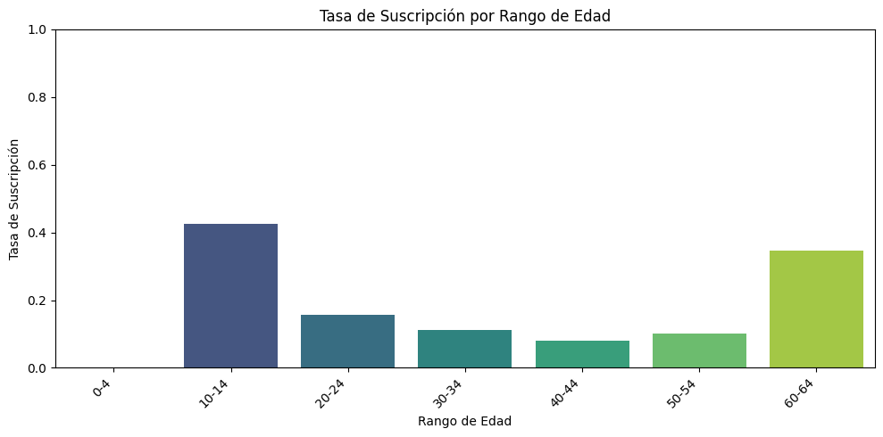
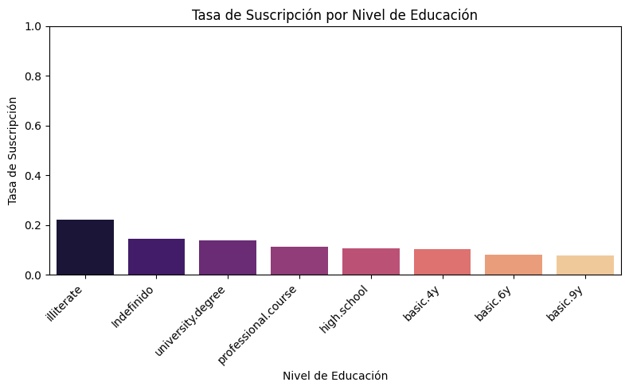
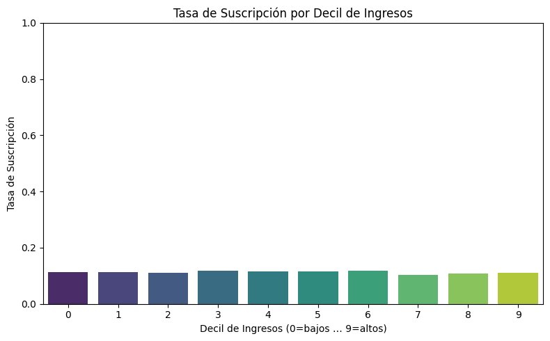
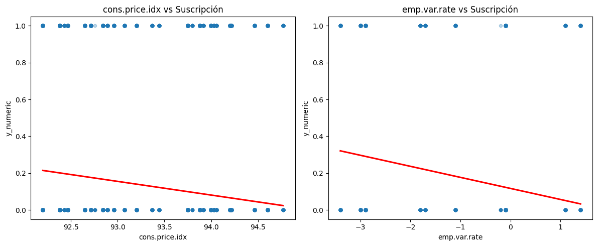
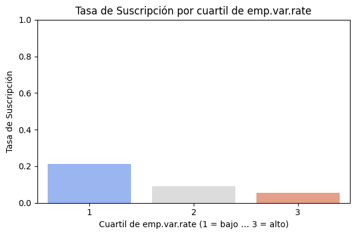
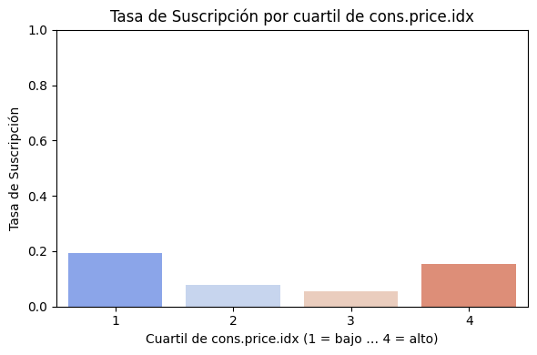

### 📊 Informe del Análisis Exploratorio de Datos (EDA) - Campañas de Marketing Bancario

## 📌 Objetivo del Proyecto
El objetivo de este proyecto es realizar un Análisis Exploratorio de Datos (EDA) sobre campañas de marketing directo realizadas por una institución bancaria portuguesa. Estas campañas se basaron en llamadas telefónicas para promover la suscripción de depósitos a plazo bancario. A menudo, se realizaron múltiples contactos con el mismo cliente para determinar si el producto sería suscrito.

## 📂 Conjuntos de Datos 

### 💼 Descripción General
Estos conjuntos de datos agrupan información detallada sobre campañas de marketing directo realizadas por teléfono por una institución bancaria portuguesa entre mayo de 2008 y noviembre de 2010. El objetivo principal era promover la suscripción de depósitos a plazo fijo entre los clientes existentes. Cada registro corresponde a un intento de llamada e incluye variables sociodemográficas, información económica y detalles específicos de la campaña (por ejemplo, mes y día de la semana del contacto, duración de la llamada, número de intentos), así como la variable objetivo **y** que indica si el cliente finalmente suscribió el depósito (*yes*/*no*).

### 📑 Estructura de Datos
1. Dataset de Campañas de Marketing (bank-additional.csv)

Este conjunto de datos contiene información relacionada con las campañas de marketing telefónicas y las características de los clientes contactados.
| Columna          | Descripción                                                                                            |
| ---------------- | ------------------------------------------------------------------------------------------------------ |
| `age`            | La edad del cliente.                                                                                   |
| `job`            | La ocupación o profesión del cliente.                                                                  |
| `marital`        | El estado civil del cliente.                                                                           |
| `education`      | El nivel educativo del cliente.                                                                        |
| `default`        | Indica si el cliente tiene algún historial de incumplimiento de pagos (1: Sí, 0: No).                  |
| `housing`        | Indica si el cliente tiene un préstamo hipotecario (1: Sí, 0: No).                                     |
| `loan`           | Indica si el cliente tiene algún otro tipo de préstamo (1: Sí, 0: No).                                 |
| `contact`        | El método de contacto utilizado para comunicarse con el cliente (teléfono, móvil, etc.).               |
| `duration`       | La duración en segundos de la última interacción con el cliente.                                       |
| `campaign`       | El número de contactos realizados durante esta campaña para este cliente.                              |
| `pdays`          | Número de días que han pasado desde la última vez que se contactó con el cliente durante esta campaña. Se asigna 999 para los que no se han contactado con el (previos=0) y no tiene campaña de marketing (poutcome="NONEXISTE")|
| `previous`       | Número de veces que se ha contactado con el cliente antes de esta campaña.                             |
| `poutcome`       | Resultado de la campaña de marketing anterior.                                                         |
| `emp.var.rate`   | La tasa de variación del empleo.                                                                       |
| `cons.price.idx` | El índice de precios al consumidor.                                                                    |
| `cons.conf.idx`  | El índice de confianza del consumidor.                                                                 |
| `euribor3m`      | La tasa de interés de referencia a tres meses.                                                         |
| `nr.employed`    | El número de empleados en la institución bancaria.                                                     |
| `y`              | Indica si el cliente ha suscrito un producto o servicio (Sí/No).                                       |
| `date`           | La fecha en la que se realizó la interacción con el cliente.                                           |
| `contact_month`  | El mes en el que se realizó la interacción durante la campaña de marketing.                            |
| `contact_year`   | El año en el que se realizó la interacción durante la campaña de marketing.                            |
| `id_`            | Un identificador único para cada registro en el dataset.                                               |

2. Dataset de Características Demográficas y Comportamiento de Compra (customer-details.xlsx)

Este conjunto de datos está en formato Excel y proporciona información demográfica.  El archivo consta de 3 hojas de trabajo, cada una representando los clientes que ingresaron al banco en diferentes años.

| Columna             | Descripción                                                     |
| ------------------- | --------------------------------------------------------------- |
| `Income`            | El ingreso anual del cliente en términos monetarios.            |
| `Kidhome`           | Número de niños en el hogar del cliente.                        |
| `Teenhome`          | Número de adolescentes en el hogar del cliente.                 |
| `Dt_Customer`       | Fecha en que el cliente se convirtió en cliente del banco.      |
| `NumWebVisitsMonth` | Número de visitas mensuales del cliente al sitio web del banco. |
| `ID`                | Identificador único del cliente.                                |
| `year`              | se crea la columna Year para unir los tres archivos en uno      |

## Estructura del Proyecto
- `data/`: Contiene el conjunto de datos original y los datos limpios.
- `notebooks/`: scrips de limpieza y Análisis y visualización en formato Jupyter Notebook. Además, contiene el script de utilidades del proyecto.
- `env/` : Configuración del entorno del proyecto.
- `Graficos/`: Gráficos de los resultados del análisis.
- `requisitos/` : Informe de requisitos del proyecto.
- `Raiz`: contiene el Informe del EDA en el archivo `README.md` y el `environment.txt` con todas las dependencias del entorno.

## 📝 Metodología del Análisis
El análisis se ha estructurado en cuatro fases principales:

- Transformación y Limpieza de Datos
- Análisis Descriptivo de los Datos
- Visualización de los Datos
- Conclusiones y Recomendaciones

## 🔄 Transformación y Limpieza de Datos

Se crearon dos **scripts** por separado: uno para el archivo `bank-additional.csv` y otro para `customer-details.xlsx`. En cada uno, para garantizar la calidad de los datos, se siguieron estos pasos:

- **Eliminación de columnas innecesarias.**
- **Conversión de tipos de datos:** ajuste de tipos incorrectos (`integer`, `float`, `date`).
- **Tratamiento de variables binarias:** tres variables binarias, al tratarse como numéricas con valores nulos, generaban outliers inesperados en los análisis cuantitativos. Para un procesamiento semánticamente correcto, reemplazamos los nulos por la categoría `Desconocido` y las convertimos a tipo `category`.
- **Imputación de valores nulos:**
    * En las columnas numéricas `['age', 'default', 'housing', 'loan', 'cons.price.idx', 'euribor3m', 'contact_year', 'contact_month']`, se imputaron valores basados en estadísticas de distribución.
    * En las columnas categóricas, se asignó el valor `Desconocido`.
- **Análisis de outliers con boxplot:**
    * **age:** aunque se detectaron 474 outliers, todas las edades están dentro de un rango humano plausible por lo que no se consideran errores.
    * **pdays:** los outliers corresponden a clientes no contactados (valor por defecto `999`), por lo que no se tratan como atípicos.
    * **duration, campaign y previous:** en lugar de eliminar registros con valores extremos, aplicamos **escalado robusto** que:
        - Centra cada variable en su mediana.
        - Escala dividiendo por el IQR (interquartile range: Q3 – Q1), reduciendo el impacto de colas largas sin distorsionar las distancias relativas entre observaciones.
    
Este enfoque mantiene todos los registros, respeta el orden original y preserva la magnitud relativa de las diferencias, ofreciendo así una distribución más estable.
- **Eliminación de duplicados:** se eliminaron registros redundantes.
- **Estandarización de datos:** se homogeneizaron valores de texto para evitar discrepancias en el análisis.

## 📊 Análisis Descriptivo de los Datos

Se realizó un análisis descriptivo para entender mejor las características del conjunto de datos:

### **Análisis Univariado Numérico**

- **Distribución de edades (age):** Predomina la clientela de adulto joven y mediana edad; algunos clientes muy ancianos podrían considerarse casos especiales.  
- **Distribución de ingresos (income):** No se observan picos pronunciados que indiquen tramos de concentración; la muestra cubre un amplio rango de niveles de ingreso.  
- **Duración de las llamadas (duration):** La mayoría de las llamadas son cortas; unas pocas muy largas elevan la media. Para el modelado, conviene transformar o acotar esos valores extremos.  
- **Días desde el último contacto (pdays):** La mayoría de clientes no había sido contactada previamente, por lo que aparecen numerosos registros con `999`.  
- **Número de empleados (nr.employed):** Se observa periodicidad trimestral, con picos en determinados trimestres.  

### **Análisis Univariado Categórico**

- **Profesión (job):** La muestra está sesgada hacia empleados de oficina y oficios técnicos; los grupos minoritarios podrían agruparse en “Otros” o filtrarse en gráficos dinámicos.  
- **Estado civil (marital):** La gran mayoría de los clientes está casada.  
- **Educación (education):** Se observa un nivel educativo alto en la muestra.  
- **Incumplimiento de pagos (default):** Muy pocos clientes presentan incumplimientos (`yes`).  
- **Hipoteca (housing):** Aproximadamente la mitad de los clientes tiene hipoteca (`yes`).  
- **Préstamo personal (loan):** La mayoría de los clientes no tiene otros préstamos.  
- **Tipo de contacto (contact):** Predomina el teléfono móvil frente al fijo.  
- **Resultado de la campaña anterior (poutcome):** La mayoría de los clientes nunca fue contactada.  
- **Suscripción al depósito (y):** La mayoría de los clientes no suscribió el producto.  

### **Análisis Univariado de Fechas**

Los datos cubren cinco años exactos (1 de enero de 2015 a 31 de diciembre de 2019). La columna `date` está bien distribuida, sin grandes huecos ni picos estacionales. Para analizar efectos de temporalidad, se generaron las columnas `year` y `month` a partir de `date`.  

### **Análisis de la Matriz de Correlación**

Al explorar la relación de la variable objetivo `y` con las variables numéricas (`duration`, `campaign`, `emp.var.rate`, `cons.price.idx`, `cons.conf.idx`, `euribor3m`, `nr.employed`), se observó una correlación baja. Incluso podría existir una ligera caída en la tasa de éxito conforme aumenta el número de contactos, pero la señal es tan débil que puede considerarse nula.

Para profundizar, se graficarán matrices de correlación centradas en `y` y estas variables, aplicando segmentaciones por categorías y grupos de interés (edad, ingreso, nivel educativo, contacto previo) para identificar posibles señales ocultas.  

### 🔍 Análisis Bivariado

#### Relación entre edad y suscripción
- Los segmentos **muy jóvenes** y **muy mayores** presentan las tasas de respuesta más altas.  
- El grupo de **edad media-adulta** (20–59 años) muestra tasas de suscripción muy bajas, lo que sugiere que quizá el mensaje o el canal no están resonando en este público.  

> En un dashboard dinámico, podrías explorar si dentro de ese rango (20–59 años) existen subgrupos con comportamientos distintos (por ejemplo, segmentar por nivel de ingresos o canal de contacto) o diseñar mensajes específicos para cada decena de edad.

#### Relación entre nivel educativo y suscripción
El gráfico revela una tendencia clara: **a menor nivel educativo, mayor tasa de suscripción**.
- El canal o mensaje resulta más atractivo para perfiles con menor formación. Quizá la forma de comunicar la oferta conecta mejor con este público.  
- Para niveles de educación media y alta, se recomienda probar mensajes o beneficios distintos (por ejemplo, funcionalidades avanzadas, simuladores de rentabilidad, etc.).  
- Para confirmar la señal, incorpora `education` en un modelo multivariado (regresión logística o árbol de decisión) junto con otras variables (edad, ingresos, historial de contacto).

#### Relación entre ingresos y suscripción
En la gráfica de regresión lineal, los ingresos **no muestran un efecto lineal relevante** sobre la probabilidad de suscripción a nivel global.  
> Para profundizar, aplica segmentaciones adicionales (por ejemplo, cuartiles de ingresos) y analiza posibles patrones en subgrupos.

#### Correlación entre condiciones macroeconómicas y suscripción
Se comparan `cons.price.idx` y `emp.var.rate` con la probabilidad de suscripción (puntos 0/1). La línea de tendencia (regresión lineal simple) muestra una pendiente ligeramente negativa en ambos casos, pero la señal es muy débil.

> **Conclusión:** Las condiciones de precio al consumidor y la variación en la tasa de empleo no parecen ser drivers directos de la suscripción.

#### Análisis por cuartiles de indicadores macroeconómicos
Comparando cuartiles de `cons.price.idx` y `emp.var.rate` con la tasa de suscripción:
- **Patrones diferentes:**  
  - La respuesta a `cons.price.idx` es no lineal, con picos en extremos.  
  - La respuesta a `emp.var.rate` es lineal-negativa.  
- **Segmentos más receptivos:**  
  - Clientes en entornos de precios bajos y empleo bajo (cuartil 1) registran conversiones ≈ 19–21 %.  
  - Cuando el empleo mejora mucho (cuartil 4), la conversión cae a mínimos (≈ 6 %), incluso si `cons.price.idx` está en su extremo alto (que por sí solo tiende a reactivar la conversión hasta ≈ 15 %).

| **Figura 1. Tasa de suscripción por cuartiles de emp.var.rate** | **Figura 2. Tasa de suscripción por cuartiles de cons.price.idx** |
|:-------------------------------------------------------------:|:----------------------------------------------------------------:|
|       |       |

> **Implicación práctica:** No existe un “combo” macroóptimo. Un escenario de precios altos puede compensar parcialmente un empleo fuerte, pero el entorno más receptivo sigue siendo el de precios y empleo bajos. Para priorizar campañas, enfócate en esos segmentos; en entornos de empleo alto, la eficacia cae drásticamente.

---

En general, variables como **edad**, **nivel educativo**, **historial de contacto** o **tipo de campaña** explican mejor la respuesta del cliente que los indicadores macroeconómicos.

## 🗺️ Conclusiones y Recomendaciones

### Edad como factor clave
- La respuesta a la campaña sigue una curva en “U”:
  - Clientes **menores de 20 años** y **mayores de 60 años** presentan las tasas de suscripción más elevadas (≈ 40–50 %).
  - El grupo **20–59 años** (adultez media) muestra un rendimiento muy bajo (≈ 8–12 %).
- **Implicación:**  
  Diseñar mensajes o canales específicos para el segmento de 20–59 años, o profundizar en sus subsegmentos (por nivel de ingresos, canal de contacto, historial) para mejorar la conexión.

---

### Educación inversamente relacionada
- A menor nivel educativo, mayor tasa de suscripción:
  - El grupo `illiterate` supera el 20 %.
  - Formación básica o secundaria ronda el 8–10 %.
- **Implicación:**  
  El tono y el canal actuales resultan atractivos para perfiles con menor formación. Para niveles medio-altos, probar comunicaciones adaptadas (mensajes más técnicos, simuladores de rentabilidad, etc.).

---

### Ingresos sin patrón lineal claro
- La correlación entre `income` y suscripción es prácticamente nula.
- La regresión lineal ajustada se mantiene plana alrededor del ≈ 11 %.
- **Implicación:**  
  Los ingresos por sí solos no explican la probabilidad de suscripción; es necesario analizar combinaciones de variables o segmentaciones más finas (deciles, interacciones).

---

### Escaso impacto de variables macroeconómicas
- Tanto `cons.price.idx` como `emp.var.rate` presentan correlaciones débiles y pendientes ligeramente negativas con la suscripción.
- El análisis por cuartiles revela:
  - `cons.price.idx`: comportamiento no lineal, con picos en los cuartiles 1 y 4.
  - `emp.var.rate`: caída casi monótona de la tasa de suscripción al aumentar la tasa de empleo.
- **Implicación:**  
  Las condiciones macroeconómicas no son factores principales; su influencia es marginal y, a menudo, inversa.

---

> **Conclusión global:**  
> El análisis exploratorio de datos (EDA) indica que las características **del cliente** (edad y educación) son los factores más determinantes de la suscripción, mientras que **los ingresos** y **las variables macroeconómicas** desempeñan un papel mucho menos relevante.  

## 🗺️ Recomendaciones para la siguiente fase: desarrollar un dashboard dinámico

Un panel interactivo permitirá a los responsables de marketing explorar los hallazgos del EDA y tomar decisiones basadas en datos en tiempo real. A continuación, se detallan los elementos clave y las funcionalidades recomendadas:

### 1. Objetivos y KPIs  
- **Objetivo principal:** visualizar la probabilidad de suscripción según distintos segmentos y condiciones macroeconómicas.  
- **KPIs recomendados:**  
  - Tasa de conversión global y por segmento (edad, nivel educativo, decil de ingresos).  
  - Evolución temporal de suscripciones (serie histórica).  
  - Impacto de `cons.price.idx` y `emp.var.rate` por cuartiles.  
  - Número de contactos frente a tasa de éxito.

### 2. Componentes y visualizaciones  
1. **Filtros dinámicos**  
   - Control deslizante de **edad** (rango arbitrario, p. ej. 30–45 años).  
   - Desplegable de **nivel educativo**.  
   - Selección de **deciles de ingresos**.  
   - Rango de **fechas** o periodos macroeconómicos.  
   - Filtro por **canal de campaña** o **número de contactos**.

2. **Gráficos principales**  
   - Diagrama de barras de tasa de suscripción por rango de edad (vinculado al deslizador).  
   - Diagrama de barras de tasa de suscripción por nivel educativo (ordenado).  
   - Gráfico de líneas de suscripción acumulada a lo largo del tiempo.  
   - Gráfico de dispersión con curva suavizada para `income` vs. probabilidad de suscripción.  
   - Mapa de calor interactivo de correlaciones (hover para ver coeficientes).  
   - Diagramas de barras por cuartiles para `cons.price.idx` y `emp.var.rate`.

3. **Tablas detalladas**  
   - Listado de segmentos con mayor y menor conversión (top/bottom N).  
   - Resumen de tamaño de muestra (número de clientes según filtros).  
   - Desglose de métricas por canal de contacto.

### 3. Interactividad y usabilidad  
- **Drill-down:** hacer clic en una barra o punto para ver la distribución interna (p. ej. edad dentro de un decil de ingreso).  
- **Exportación:** descargar datos filtrados en CSV o imagen de los gráficos.  
- **Tooltips enriquecidos:** al pasar el cursor, mostrar número de observaciones, % de suscriptores, coeficiente de correlación local, etc.  
- **Actualización automática:** refresco diario o en tiempo real si los datos del CRM/ERP cambian.

### 4. Tecnología y arquitectura  
- **Herramientas recomendadas:**  
  - **Tableau** o **Power BI** para despliegue rápido y conexión nativa a bases de datos.  
  - **Plotly Dash**, **Streamlit** o **Shiny** (R) para mayor personalización.  
- **Back-end:**  
  - Data Warehouse o vistas SQL optimizadas (BigQuery, Snowflake, Redshift).  
  - APIs RESTful (para frameworks a medida).  
- **Seguridad y acceso:**  
  - Autenticación y roles (marketing, dirección, analistas).  
  - Permisos diferenciados para editar filtros o solo visualizar.

### 5. Mantenimiento y evolución  
- **Documentación integrada:**

## 📑 Informe de Calidad de Datos

**Calidad de los datos**  
Tras el proceso de limpieza, los datos se encuentran en **óptimas condiciones** para el análisis:  
- Se eliminaron duplicados y registros inválidos.  
- Se estandarizaron formatos de fecha y categorías.  
- Se verificó la consistencia interna de cada variable.

**Limitaciones**  
- **Valores inconsistentes** en algunos campos (p. ej. formatos mixtos, outliers).  
- **Tratamiento aplicado**:  
  - **Imputación** de valores faltantes en variables numéricas de baja incidencia tomando en cuenta para ello la mediana.  
  - **No se eliminaron datos**

---
## 📝 Contacto
Si tienes alguna duda o sugerencia sobre el proyecto, no dudes en contactar con  María Victoria Cairós González.